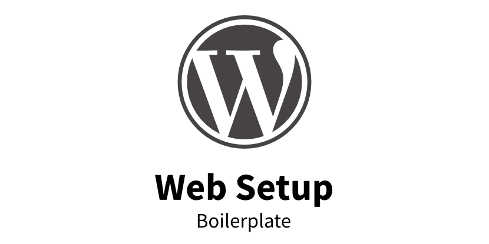

# Web Setup

- [About](#about)
- [Features](#features)
- [How to use](#how-to-use)

 

---

  

## About

Security-focused structural boilerplate for any WordPress webs. Opinionated features that might not work with any hosting. Only use if you know what you are doing and are comfortable editing server files.

**Intended for developers – Not end users**

  

## Features

### Security

- xxx

  

## How to use

Copy the folder content in your WordPress installation.
